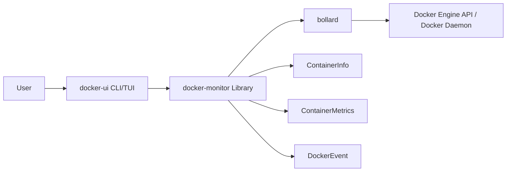
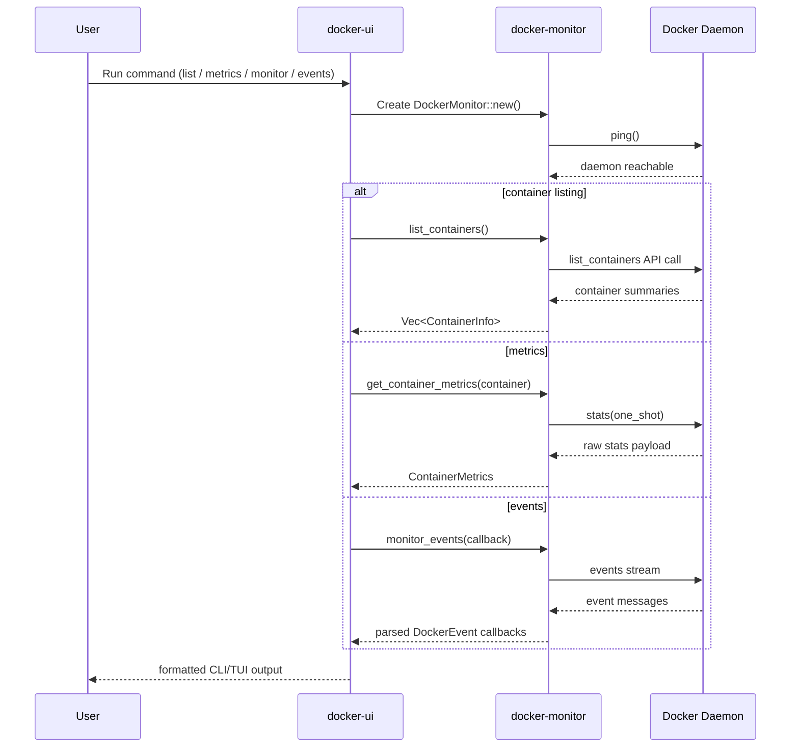

# Docker Monitoring Tool

A Rust-based Docker monitoring project with two crates:

- **`docker-monitor`**: a reusable library built on top of Docker Engine API (via `bollard`)
- **`docker-ui`**: a CLI + interactive TUI application for operational monitoring

## Features

### Core library (`docker-monitor`)
- Connects to the local Docker daemon and validates connectivity with `ping`
- Lists running containers with basic metadata (id, name, image, state, labels, ports)
- Inspects individual containers
- Starts and stops containers
- Collects one-shot metrics per container:
  - CPU usage
  - Memory usage
  - Network I/O
  - Disk I/O
- Streams Docker container events through callback-based monitoring
- Exposes typed data models and unified error handling

### Application (`docker-ui`)
- Human-friendly commands with `clap`
- Multiple output formats for listing containers (`table`, `json`, `compact`)
- Real-time metrics for one container (`--follow`) or all running containers (`dashboard`)
- Container lifecycle operations (`start`, `stop`)
- Live Docker event stream with optional filtering
- Interactive terminal dashboard (`monitor`) using `ratatui` + `crossterm`

## Project Structure

```text
docker-monitoring-tool/
├── docker-monitor/
│   ├── src/
│   │   ├── lib.rs
│   │   ├── monitor.rs
│   │   ├── metrics.rs
│   │   ├── container.rs
│   │   ├── events.rs
│   │   └── error.rs
│   ├── examples/
│   └── tests/
└── docker-ui/
    └── src/
        ├── main.rs
        ├── commands.rs
        ├── display.rs
        └── tui/
```

## Architecture



## Runtime Data Flow



## How It Works

1. `docker-ui` parses command-line arguments and routes to command handlers.
2. Each handler creates a `DockerMonitor` client from `docker-monitor`.
3. The library calls Docker APIs via `bollard` and maps results into typed Rust structs.
4. The UI layer renders output as:
   - terminal tables/text (`list`, `info`, `metrics`, `dashboard`, `events`, `system`)
   - interactive TUI panels (`monitor`)

## Build and Run

### Prerequisites
- Rust (stable, edition 2021)
- Docker installed and running locally

### Build

```bash
cd /home/docker-monitoring-tool/docker-ui
cargo build
```

### Run CLI commands

```bash
# List containers
cargo run -- list

# List as JSON
cargo run -- list --format json

# Container details
cargo run -- info <container_id_or_name>

# One-shot metrics
cargo run -- metrics <container_id_or_name>

# Continuous metrics
cargo run -- metrics <container_id_or_name> --follow --interval 2

# Dashboard for all running containers
cargo run -- dashboard --interval 2

# Start / stop
cargo run -- start <container_id_or_name>
cargo run -- stop <container_id_or_name>

# Monitor Docker events
cargo run -- events
cargo run -- events --filter start

# System summary
cargo run -- system

# Interactive TUI monitor
cargo run -- monitor --interval 1
```

## Keyboard Controls (TUI)

- `q` / `Esc`: quit
- `Tab` / `Shift+Tab`: switch tabs
- `1`, `2`, `3`: jump to Overview / Containers / Metrics
- `↑` `↓` or `j` `k`: navigate containers
- `r`: manual refresh

## Library Examples

From `docker-monitor` crate:

```bash
cd /home/docker-monitoring-tool/docker-monitor
cargo run --example basic_usage
cargo run --example container_management
cargo run --example event_monitoring
cargo run --example metrics_stream
```

## Testing

```bash
cd /home/docker-monitoring-tool/docker-monitor
cargo test
```

> Some integration tests depend on Docker daemon availability and running containers.
